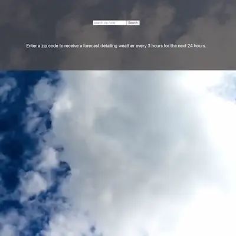

 
## Weather

This is a basic weather app - search by zip code to find the weather forecast around the world.

## Project Status
Deployed at [chelsea-avery.com/weather](https://www.chelsea-avery.com/weather/)

## Project Screenshot

## Installation and Setup Instructions

#### Example:  

Clone down this repository. You will need `node` and `npm` installed globally on your machine.  

Installation:

`npm install`  

To Run Test Suite:  

`npm test`  

To Start Server:

`npm start`  

To Visit App:

`localhost:3000/weather`  

## Reflection

I set out to build my a project that could utilize RESTful API to integrate data from OpenWeather API. I also wanted to make the project with the React.js library, therefore I used the 'create-react-app' boilerplate. 

One of the main challenges I ran into was effectively styling the forecast display for usability. Additionally, carrying endpoints from development to production and deployment was a valuable learning process.            
                                                    
     
--Chelsea Avery--    
📫 chelseaavery.js@gmail.com    
🐙 https://github.com/chelseaerinavery     
💼 https://www.linkedin.com/in/chelseaavery/     
👩‍💻 [chelsea-avery.netlify.app](chelsea-avery.netlify.app)    